# Assistente Empresarial - Plataforma B2B de Atendimento e Suporte com RAG Multi-Tenant

Plataforma SaaS B2B corporativa que permite a diferentes empresas clientes criarem e personalizarem seus próprios assistentes virtuais inteligentes de atendimento, suporte ao cliente e treinamento de funcionários, alimentados por **RAG (Retrieval-Augmented Generation)** com modelos locais via **Ollama** e **LangChain4j**.

---

## 🏗️ 1. Arquitetura do Sistema (Multi-Tenant)

O sistema adota isolamento rigoroso por inquilino (*tenant*). Cada empresa cadastrada possui sua base de conhecimento, usuários e histórico de atendimentos completamente isolados.

```mermaid
flowchart TD
    subgraph Ingestao["1. Ingestão de Documentos (Base de Conhecimento)"]
        Arquivo["Upload de Arquivo (PDF, DOCX, TXT, CSV)"] --> Storage["Armazenamento Local (uploads/empresaId)"]
        Storage --> Tika["Apache Tika (Extração de Texto)"]
        Tika --> Chunker["DocumentSplitters (800 chars / 100 overlap)"]
        Chunker --> Metadata["Etiquetagem com Metadata (empresa_id, documento_id)"]
        Metadata --> OllamaEmbed["Ollama nomic-embed-text (768 dimensões)"]
        OllamaEmbed --> VectorStore["pgvector / EmbeddingStore"]
    end

    subgraph Chat["2. Fluxo de Atendimento com RAG"]
        Cliente["Cliente Final (Widget / Web)"] --> PublicAPI["POST /api/publico/chat/{slug}/mensagem"]
        PublicAPI --> VectorSearch["Busca Semântica no VectorStore filtrada por empresa_id"]
        VectorSearch --> PromptBuilder["Montagem do Prompt (Regras + Contexto Recuperado)"]
        PromptBuilder --> OllamaChat["Ollama llama3.2 (Geração de Resposta)"]
        OllamaChat --> Resposta["Resposta com Fontes Citadas"]
        OllamaChat -.->|Detecta pedido de atendente| Transbordo["Transbordo Humano (AGUARDANDO_HUMANO)"]
    end
```



---

## 🚀 2. Principais Funcionalidades Implementadas

### A. Isolamento Multi-Tenancy & Segurança
- **Duplo Mecanismo de Autenticação**:
  - **JWT (Painel de Gestão)**: Usuários autenticados acessam suas contas com claims de perfil (`ROLE_ADMIN`, `ROLE_FUNCIONARIO`) e `empresaId` propagados na thread atual via `TenantContext`.
  - **API Key (`X-API-Key`)**: Integrações externas e microsserviços acessam a API autenticados como `ROLE_API_CLIENT`.
- **Tratamento Global de Exceções**: Centralizado em `GlobalExceptionHandler` com retornos padronizados via `ErrorResponseDTO` (400, 401, 403, 404, 409 e 500) e validação de campos via Jakarta Bean Validation.

### B. Ingestão de Documentos (RAG)
- Suporte para upload de múltiplos formatos: **PDF, DOCX, DOC, TXT, CSV e Markdown**.
- Leitura e extração de texto automatizada via **Apache Tika**.
- Fatiamento (*chunking*) recursivo com preservação de contexto.
- Armazenamento físico de arquivos particionado por cliente em diretório local configurável (`uploads/{empresaId}/`).
- Exclusão em cascata: ao deletar um documento, o arquivo em disco, o registro no banco relacional e os vetores no banco vetorial são removidos.

### C. Motor de IA e RAG (LangChain4j + Ollama)
- **Embeddings**: Modelo local `nomic-embed-text` (dimensão 768).
- **LLM de Chat**: Modelo local `llama3.2` com temperatura controlada e prompt de sistema rigoroso para evitar alucinações.
- **Isolamento na Busca Vetorial**: Filtro estrito por metadado `empresa_id` em toda consulta semântica (`MetadataFilterBuilder`).
- **Citação de Fontes**: As respostas indicam quais documentos serviram de base para a resposta.
- **Transbordo para Atendimento Humano**: Reconhecimento automático de intenção quando o usuário solicita atendente humano ou quando a IA não localiza a resposta na base.

### D. Personalização Visual & Widget de Chat Embutível
- Cada assistente possui identidade visual própria:
  - Cores (primária e secundária), URL de avatar, mensagem de boas-vindas e tom de voz (Amigável, Formal ou Técnico).
- **Widget JavaScript (`widget.js`)**: Script vanilla JS autônomo (sem dependências de frameworks) pronto para ser embutido em qualquer site (WordPress, Shopify, HTML puro):
  ```html
  <script src="http://localhost:8080/widget.js" data-slug="slug-da-empresa"></script>
  ```
- **Página de Demonstração**: Hospedada em `http://localhost:8080/` para testes imediatos.

---

## 🛠️ 3. Stack Tecnológica

| Componente | Tecnologia | Finalidade |
|---|---|---|
| **Backend** | Java 17 + Spring Boot | API REST corporativa e regras de negócio |
| **Framework RAG** | LangChain4j (0.36.2) | Orquestração de LLM, embeddings e chunking |
| **Modelos de IA** | Ollama (`llama3.2` + `nomic-embed-text`) | Execução local e privada de IA sem custos de API externa |
| **Parser de Arquivos**| Apache Tika (LangChain4j) | Extração de texto de PDFs, DOCX, TXT e CSVs |
| **Banco Relacional**| PostgreSQL | Usuários, empresas, assistentes, conversas e mensagens |
| **Banco Vetorial** | pgvector (com fallback InMemory) | Armazenamento e busca de similaridade de vetores |
| **Segurança** | Spring Security + JWT (JJWT) | Autenticação stateless e controle de permissões |
| **Documentação** | SpringDoc OpenAPI (Swagger UI) | Documentação interativa dos endpoints |

---

## 📋 4. Principais Endpoints da API

### Autenticação & Empresas
- `POST /api/empresas/registro`: Cadastro público de nova empresa e seu administrador inicial.
- `POST /api/auth/login`: Autenticação de usuário e retorno do token JWT.
- `GET /api/empresas/me`: Consulta dados da empresa do usuário autenticado.
- `PUT /api/empresas/me`: Atualização de dados da empresa.

### Base de Conhecimento (Documentos)
- `POST /api/documentos/upload`: Upload de arquivo multipart (`file`) para ingestão RAG.
- `GET /api/documentos`: Lista todos os documentos processados da empresa logada.
- `DELETE /api/documentos/{id}`: Remove o documento, arquivo físico e vetores associados.

### Atendimento & Chat (Público / Widget)
- `GET /api/publico/chat/{slug}/config`: Retorna nome, cores e mensagem de boas-vindas do assistente para montagem do widget.
- `POST /api/publico/chat/{slug}/mensagem`: Endpoint público do widget para envio de dúvidas e obtenção de respostas do RAG.

### Atendimento Interno & Gestão
- `POST /api/chat/mensagem`: Chat interno para colaboradores autenticados.
- `GET /api/chat/conversas`: Listagem de todas as sessões de chat para monitoramento do gestor.
- `GET /api/chat/conversas/{id}/mensagens`: Histórico detalhado de mensagens de uma conversa.

---

## ⚙️ 5. Como Executar o Projeto Localmente

### Pré-requisitos
1. **Java 17+** e **Maven** instalados.
2. **PostgreSQL** em execução (configurado em `src/main/resources/application.properties`).
3. **Ollama** instalado e em execução: [https://ollama.com](https://ollama.com).

### Passo 1: Baixar os Modelos no Ollama
No terminal, baixe os modelos configurados:
```bash
ollama pull llama3.2
ollama pull nomic-embed-text
```

### Passo 2: Configurar o Banco de Dados
Certifique-se de que a base PostgreSQL `assistenteEmpresarial` existe:
```sql
CREATE DATABASE "assistenteEmpresarial";
```
*(Opcional para pgvector)*: Caso deseje habilitar a extensão nativa vetorial no PostgreSQL:
```sql
CREATE EXTENSION IF NOT EXISTS vector;
```

### Passo 3: Iniciar a Aplicação
Compile e execute o projeto com o Maven:
```bash
mvn clean spring-boot:run
```

A aplicação subirá em: `http://localhost:8080`.

---

## 🧪 6. Testando a Solução

1. Acesse o **Swagger UI**:
   - `http://localhost:8080/swagger-ui/index.html`
2. Acesse a **Página de Demonstração do Widget**:
   - `http://localhost:8080/`
3. Cadastre uma empresa via `POST /api/empresas/registro`:
   ```json
   {
     "nomeEmpresa": "Tech Support LTDA",
     "slug": "tech-support",
     "nomeAdmin": "Carlos Administrador",
     "emailAdmin": "admin@techsupport.com",
     "senhaAdmin": "123456"
   }
   ```
4. Autentique-se via `POST /api/auth/login` e copie o `token`.
5. Envie um PDF com políticas ou regras de negócio em `POST /api/documentos/upload` com o cabeçalho `Authorization: Bearer <TOKEN>`.
6. Faça uma pergunta para a IA via `POST /api/publico/chat/tech-support/mensagem`:
   ```json
   {
     "mensagem": "Qual o procedimento de reembolso segundo as regras?"
   }
   ```
7. A IA responderá estritamente com base no PDF enviado, citando o nome do arquivo nas fontes consultadas!
